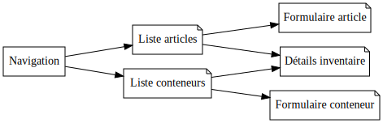

# Analyse

## Contexte

L'Université de Mons héberge une structure que nous avons appelé "Le CLICK".
Cette structure fournit différents services pour aider les entreprises et porteurs de projets innovants.
Afin de réaliser des prototypes, nous y avons créé un FabLab, c'est-à-dire un atelier ouvert au public où chacun et chacune peut utiliser différentes machines de fabrication numérique.
Le FabLab possède son atelier IoT qui possède une réserve d'articles : microcontrôleurs, capteurs et autres éléments électroniques.
Se pose donc la question du rangement.

Le rangement doit permettre de répondre à plusieurs questions.

- Qu'est-ce que j'ai en stock ?
  Quelles sont les références d'articles que je peux utiliser dans mes projets ou proposer à mes visiteurs ?
- Combien m'en reste-t-il ?
  Est-ce que j'ai assez d'éléments pour réaliser mon projet ?
  Est-ce que je dois en recommander lors de ma prochaine commande ?
- Où est-ce que ça se trouve ?
  Idéalement, je dois pouvoir localiser chaque article en moins de 30 secondes.
  Or, le FabLab s'étend sur plusieurs pièces.
  Chaque pièce contient plusieurs armoires.
  Chaque armoire, plusieurs compartiments, boîtes ou autres conteneurs.
  Et j'y ai déjà travaillé suffisamment longtemps pour savoir que dans un lieu comme le FabLab, tout le monde se sert, mais tout le monde ne range pas.
  Je devrai donc être capable de régulièrement et facilement tout remettre à sa place, conteneurs comme articles.

Les articles vont être livrés au CLICK.
Le FabLab Manager devra alors les encoder dans le catalogue s'il s'agit de nouveaux articles.
Il devra ensuite leur trouver une place dans l'un des conteneur.A
Enfin, au fur et à mesure qu'ils seront utilisés dans les projets, les articles sortiront de l'inventaire.

## Use cases

Un seul acteur est identifié : le FabLab manager.
Il n'y a donc probablement pas besoin d'une gestion d'utilisateur.
Si l'application n'est pas accessible depuis l'extérieur, une authentification est également superflue.

Au niveau de la gestion du projet, UC1 et UC2 seront les premiers à réaliser car ils ne dépendent pas d'autres use cases.
UC3, UC4 et UC5 auront certainenement une base commune pour l'affichage de l'information.

## Navigation

L'application aura une barre de navigation pour aller d'une page à l'autre.
Les listes auront un formulaire de filtrage pour limiter la liste aux éléments recherchés.

Les formulaires, une fois soumis, affiche un nouveau formulaire vide afin de faciliter l'encodage en série.

## Classes

## Analyse détaillée des use cases de modification d'inventaire (5 et 6)

La modification d'un inventaire suit la même séquence dans les deux cas.

Mais les formulaires de consultation et modification de l'inventaire sont différents.

Voici le formulaire d'inventaire d'un composant :

Voici celui d'un conteneur :

## Déploiement

### Environnement de développement

En développement, la variable d'environnement `ENV_NODE` vaut `development` et le module `nodemon` permet de redémarrer le serveur à chaque modification de fichiers.

### Environnement de production

En production, c'est le module `PM2` qui remplace `nodemon`.
La variable d'environnement `ENV_NODE` vaut `production`, ce qui va enclencher les comportements décrits sur [le site du serveur applicatif Express](https://expressjs.com/en/advanced/best-practice-performance.html#set-node_env-to-production), notamment une utilisation plus agressive des caches.

## Pistes d'amélioration

* Transformer les drop-downs d'inventaire en utilisant Fetch API.
* Dans les drop-downs d'inventaire, il faut supprimer les composants ou les conteneurs qui font déjà partie de l'inventaire.
* Trier les valeurs dans les drop-downs d'inventaire.
* Afficher l'ensemble des composants du catalogue ou l'ensemble des conteneurs de la liste + pagination.
